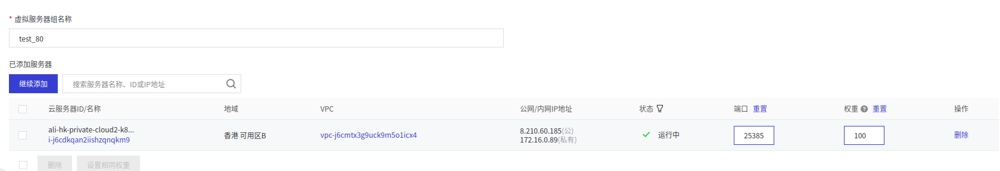

资料:https://cert-manager.io/docs/configuration/acme/#creating-a-basic-acme-issuer
~~~bash
# Kubernetes 1.16+
$ kubectl apply -f https://github.com/jetstack/cert-manager/releases/download/v1.1.0/cert-manager.yaml

# Kubernetes <1.16
$ kubectl apply --validate=false -f https://github.com/jetstack/cert-manager/releases/download/v1.1.0/cert-manager-legacy.yaml
~~~
**环境：k8s1.18.3,cert-manager v0.15.1,集群必须已经装有 Ingress Controller**
cert-manager+nginx-ingress+letsencrypt的免费套餐
官方网站:https://cert-manager.io/docs/faq/acme/
## 1. Installing with regular manifests
`wget https://github.com/jetstack/cert-manager/releases/download/v0.15.1/cert-manager.yaml`

## 2. configuration
参考:https://cert-manager.io/docs/configuration/acme/
创建一个签发机构,使用ACME的Let’s Encrypt自动管理证书
letsencrypt提供免费的SSL证书
配置`staging`环境使用的 Let‘s Encrypt ClusterIssuer，并创建：
```
apiVersion: cert-manager.io/v1alpha2
kind: ClusterIssuer
metadata:
  name: letsencrypt-staging
spec:
  acme:
    # You must replace this email address with your own.
    # Let's Encrypt will use this to contact you about expiring
    # certificates, and issues related to your account.
    email: tony@lwork.com
    server: https://acme-staging-v02.api.letsencrypt.org/directory
    privateKeySecretRef:
      # Secret resource that will be used to store the account's private key.
      name: letsencrypt-staging
    # Add a single challenge solver, HTTP01 using nginx
    solvers:
    - http01:
        ingress:
          class: nginx
```
配置`production`环境使用的 Let‘s Encrypt ClusterIssuer，并创建：
```
apiVersion: cert-manager.io/v1alpha2
kind: ClusterIssuer
metadata:
  name: letsencrypt-prod
spec:
  acme:
    # You must replace this email address with your own.
    # Let's Encrypt will use this to contact you about expiring
    # certificates, and issues related to your account.
    email: tony@lwork.com
    server: https://acme-v02.api.letsencrypt.org/directory
    privateKeySecretRef:
      # Secret resource that will be used to store the account's private key.
      name: letsencrypt-prod
    # Add a single challenge solver, HTTP01 using nginx
    solvers:
    - http01:
        ingress:
          class: nginx
```
*   metadata.name 是我们创建的签发机构的名称，后面我们创建证书的时候会引用它
*   spec.acme.email 是你自己的邮箱，证书快过期的时候会有邮件提醒，不过 cert-manager 会利用 acme 协议自动给我们重新颁发证书来续期
*   spec.acme.server 是 acme 协议的服务端，我们这里用 Let’s Encrypt，这个地址就写死成这样就行
*   spec.acme.privateKeySecretRef 指示此签发机构的私钥将要存储到哪个 Secret 对象中，名称不重要
*   spec.acme.http01 这里指示签发机构使用 HTTP-01 的方式进行 acme 协议 (还可以用 DNS 方式，acme 协议的目的是证明这台机器和域名都是属于你的，然后才准许给你颁发证书)
**这里分别配置了测试环境与生产环境两个 ClusterIssuer， 原因是 Let’s Encrypt 的生产环境有着非常严格的接口调用限制，最好是在测试环境测试通过后，再切换为生产环境。**
**letsencrypt的测试环境和生产环境的区别：** https://letsencrypt.org/zh-cn/docs/staging-environment/

## 3. 测试
参考:https://cert-manager.io/docs/usage/ingress/
**这里我假设你已安装好 Nginx Ingress Controller 并已存在一个 Ingress 对象**，现在为它开启 TLS 选项
```
apiVersion: extensions/v1beta1
kind: Ingress
metadata:
  name: my-nginx
  namespace: crm
  annotations:
    kubernetes.io/ingress.class: "nginx"
    kubernetes.io/tls-acme: "true"
    cert-manager.io/cluster-issuer: "letsencrypt-prod"
spec:
  rules:
  - host: nginx.lwork.com
    http:
      paths:
      - backend:
          serviceName: my-nginx
          servicePort: 80
        path: /
  tls:
  - secretName: nginx.lwork.com
    hosts:
    - nginx.lwork.com
```
* 在创建第一个ingress规则的时候报错`Internal error occurred: failed calling webhook "validate.nginx.ingress.kubernetes.io": an error on the server ("") has prevented the request from succeeding`
* 处理办法`kubectl delete -A ValidatingWebhookConfiguration ingress-nginx-admission`
**之后 Cert-manager 会读取注解并创建证书，使用以下命令查看：**
**会自动创建certificate，会自动http跳转https**
```
kubectl get certificate -n crm
NAME             READY   SECRET           AGE
test-nginx-tls   False   test-nginx-tls   32m
```
**当 Ready 为 True 时代表证书安装成功**

#  Troubleshooting
若出现问题参考 :https://cert-manager.io/docs/faq/acme/ 下的  **Troubleshooting Issuing ACME Certificates**

首先查看cert-manager日志

### **cert-manager+nginx-ingress+letsencrypt的几种简单架构**
一、启用slb监听80和443端口，slb启用一个虚拟服务器指向k8s所在的服务器监听后端端口57997(这个端口是目前ingress-nginx的svc监听443的端口)，然后域名解析地址修改到这个slb
1. 默认已有ingress-nginx，cert-manager和测试用的后端服务。
`ingress-nginx-controller             NodePort    10.101.133.55   <none>        80:25385/TCP,443:31146/TCP`
`rabbitmq                   NodePort    10.106.25.24     <none>        15672:35506/TCP,25672:11316/TCP`
2. 新建slb监听80和443，slb启用一个虚拟服务器指向ingress-nginx所在的服务器监听后端端口25385和31146

3. 新建ingress，配置域名指向对应服务的svc
```
apiVersion: extensions/v1beta1
kind: Ingress
metadata:
  name: rabbitmq-ui
  namespace: crm
  annotations:
    kubernetes.io/ingress.class: "nginx"
    cert-manager.io/cluster-issuer: "letsencrypt-prod"
spec:
  rules:
  - host: nginx.lwork.com
    http:
      paths:
      - backend:
          serviceName: my-nginx
          servicePort: 80
        path: /
  - host: rabbitmq-cloud2.lwork.com
    http:
      paths:
      - backend:
          serviceName: rabbitmq
          servicePort: 15672
        path: /
```
**配置证书后的域名访问，http会强制308跳转到https**
    解决：
        给ingress添加注解
        nginx.ingress.kubernetes.io/ssl-redirect: "false" 取消强制ssl                   ?????????
        nginx.ingress.kubernetes.io/force-ssl-redirect: "false"  取消强制ssl      ?????????

二、启用nginx配置stream到ingress-nginx的svc监听的端口上。(当服务器80和443被占用，可以重新监听任何端口，只不过最前面需要一个slb)，再转向后端的nginx。
1.系统ubuntu18.04，nginx1.14.0,ingress-nginx,cert-manager,在k8s中跑个nginx容器，域名解析已经指向这台服务器。
2. nginx配置stream指向ingress-nginx.svc的53058和30187
nginx直接使用的apt install，自带stream模块
```
stream {
    log_format  proxy '$remote_addr $remote_port - [$time_local] $status $protocol '
                  '"$upstream_addr" "$upstream_bytes_sent" "$upstream_connect_time"' ;
    access_log /var/log/nginx/proxy.log proxy;
    upstream ingress_80 {
            server 10.81.24.51:53058 weight=5 max_fails=3 fail_timeout=30s;
    }
    upstream ingress_443 {
            server 10.81.24.51:30187 weight=5 max_fails=3 fail_timeout=30s;
    }
    server {
            listen 80;
            proxy_connect_timeout 3s;
            proxy_timeout 3s;
            proxy_pass ingress_80;
    }
    server {
            listen 443;
            proxy_connect_timeout 3s;
            proxy_timeout 3s;
            proxy_pass ingress_443;
    }
}
```
3. 部署ClusterIssuer
4. 配置ingress
```
apiVersion: extensions/v1beta1
kind: Ingress
metadata:
  annotations:
    cert-manager.io/cluster-issuer: letsencrypt-prod
    kubernetes.io/ingress.class: nginx
    kubernetes.io/tls-acme: "true"
  name: my-nginx
  namespace: crm
spec:
  rules:
  - host: testnginx.lwork.com
    http:
      paths:
      - backend:
          serviceName: my-nginx
          servicePort: 80
        path: /
```
先验证容器中nginx是否正常，再添加ssl
```
  tls:
  - hosts:
    - testnginx.lwork.com
    secretName: testnginx.lwork.com
```
检查cert-manager日志来排错。
三、ingress-nginx.svc监听在80和443,nginx启动800端口，ingress-nginx.svc都转发到800端口(前提是kubeapiserver的端口做过修改- --service-node-port-range=80-61000)
1. 新建svc `kubectl edit svc -n crm crm`
```
spec:
  ports:
  - port: 80
    protocol: TCP
    targetPort: 800
  sessionAffinity: None
  type: ClusterIP
```
2. 新建ingress `kubectl edit ingress -n crm crm`
```
spec:
  rules:
  - host: bk.mentaricrm.com
    http:
      paths:
      - backend:
          serviceName: crm
          servicePort: 80
        path: /
```
3. nginx新建配置文件
```
server {
    listen     800;
    server_name bk.mentaricrm.com;
    access_log  /var/log/nginx/bk.mentaricrm.com.log  main;
    set $getui $cookie_feVersion;
```


