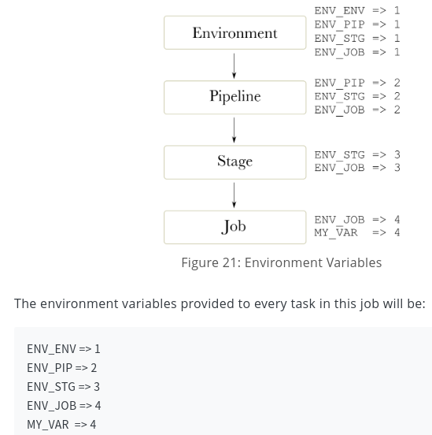
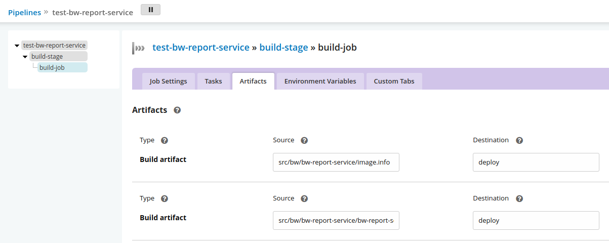

引用自https://docs.gocd.org/current/introduction/concepts_in_go.html#resources
**Automatic pipeline scheduling**
“自动管道调度”。实际上，这与将第一阶段标记为手动相同(On Success , Manual)
**Environment Variables** 
此处定义的环境变量是在agent上设置的，可以在您的job的tasks中使用。
可以在多个级别上定义环境变量：在环境内，管道内，阶段内和作业内。它们遵循级联系统，其中在“环境”级别定义的环境变量被在管道级别定义的环境变量覆盖，依此类推。
原来的图片

**最终是job级别的环境变量优先**
----------

**Parameters**
参数有助于减少配置中的重复，并与模板结合使用可让您设置复杂的配置。
**Artifacts**
Pipeline的各个环节本质上是在验证构建出的artifact,是否符合质量标准，这就要求pipeline能够正确识别和传递artifact.
GoCD provides a special task called a “Fetch Artifact Task”, which allows artifacts to be fetched and used, from any ancestor pipeline - that is, any pipeline that is upstream of the current pipeline. GoCD will ensure that the correct version of the artifact is fetched, irrespective of anything else that might be going on in the system.如果是获取的jar包之类的是很有用的，能保证后面的stage都用的是build阶段构建出来的包。使用镜像的时候，可以使用声明一个文件
```
dimages=registry-hk-tools.lwork.com/bw-report-service:master-9
deploy=bw-report-service
```
下游获取到这个文件，**然后根据文件内容再来进行k8s发布。**

**上游构建stage将artifact到gocd自带的artefact repository**
原来的图片

**下游部署stage从构建stage抓取artifact**
原来的图片

**Materials**
Pipeline dependency material
Materials really start becoming powerful when a stage in a pipeline is used as a material for another pipeline.

In the image shown below, Stage 2 of Pipeline 1 is configured as a material for Pipeline 2. Whenever Stage 2 of Pipeline 1 finishes successfully, Pipeline 2 triggers. In a setup such as this, Pipeline 1 is called the Upstream Pipeline and Pipeline 2 is called the Downstream Pipeline. Stage 2 of Pipeline 1 is called the Upstream Dependency of Pipeline 2.

**Fetch Materials**
仅在完全不关心Artifacts的情况下，才应关闭“Fetch Materials”选项。在某些情况下，您只希望管道的计时器触发器-不在乎已检出物料的修订版-或出于某种原因想要自己检出物料。然后，您将关闭“获取材料”。

Pipeline可由若干个stage组成，stage之间可以设置依赖关系，默认上游stage失败的时候不会触发下游stage。stage可由多个job组成，但多个job一般用在并行任务的用例中（例如并行构建多个模块），它们之间是没有依赖关系的，所以如果你希望某个stage执行一系列有依赖关系的动作，应该使用单个job并为其设置多个task

**Managing dependencies**
引用https://docs.gocd.org/current/configuration/managing_dependencies.html
**Fetching artifacts from an upstream pipeline**
引用https://docs.gocd.org/current/configuration/managing_dependencies.html
