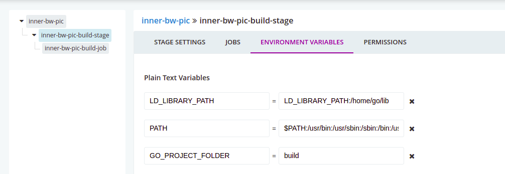

引用[https://neveryu.github.io/2018/07/20/yarn/](https://neveryu.github.io/2018/07/20/yarn/)
在 Node 生态系统中，依赖通常安装在项目的**node_modules**文件夹中。然而，这个文件的结构和实际依赖树可能有所区别，因为重复的依赖可以合并到一起。`npm`客户端把依赖安装到`node_modules`目录的过程具有不确定性。这意味着当依赖的安装顺序不同时，`node_modules`目录的结构可能会发生变化。这种差异可能会导致类似“我的电脑上可以运行，别的电脑上不行”的情况，并且通常需要花费大量时间定为与解决。
1.服务器安装npm 未完成
2.使用npm 安装yarn，不全局安装，会在当前目录安装 未完成
3.将安装好的yarn拷贝到指定目录
`cp -r yarn/ /data1/ops/homego/node-v11.8.0-linux-x64/lib/node_modules`
4.软连接到node的bin下
`ln -s ../lib/node_modules/yarn/bin/yarn.js yarn`
1.下载需要的版本
`https://nodejs.org/en/download/releases/`
`cd /data1/ops/homego #该目录是挂载到k8s的gocd静态存储卷` 
`wget https://nodejs.org/download/release/v11.8.0/node-v11.8.0-linux-x64.tar.gz`
`tar zxf node-v11.8.0-linux-x64.tar.gz`
# pipline,stage,job每一步都可以设置环境变量，具体设置在那一步，看情况

`$PATH:/usr/bin:/usr/sbin:/sbin:/bin:/usr/local/bin:/usr/local/sbin:/home/go/go/bin:/home/go/bin:/home/go/java/bin:/home/go/java10/bin:/home/go/maven/bin:/home/go/node-v10.15.3-linux-x64/bin`
```
root@ali-hk-public-ops-k8s-master01:/data1/ops/homego# pwd
/data1/ops/homego
root@ali-hk-public-ops-k8s-master01:/data1/ops/homego# ls -lh
total 348K
drwxr-xr-x   3 nginx nginx  109 Sep 18  2019 bin
drwxr-xr-x  10 nginx nginx  253 Jan 24  2019 go
drwxr-xr-x 258 nginx nginx 8.0K Jan 24  2019 gocache
drwxr-xr-x   9 nginx nginx  120 Sep 18  2019 golang_comm_vendor
drwxr-xr-x   7 nginx nginx  245 Oct  6  2018 java
drwxr-xr-x   9 root  root   107 Aug 12  2019 jdk-12.0.2
drwxr-xr-x   2 nginx nginx   50 Mar 10  2019 lib
drwxr-xr-x   6 nginx nginx   99 Dec 26  2018 maven
drwxr-xr-x   4 nginx root    57 Nov 29  2019 node_modules
drwxrwxr-x   7 nginx nginx  119 Sep 18  2019 node-v10.15.3-linux-x64
drwxrwxr-x   6 nginx nginx  108 Apr 11  2019 node-v11.14.0-linux-x64
drwxrwxr-x   6   500   500  108 Jan 25  2019 node-v11.8.0-linux-x64
drwxrwxr-x   6 nginx nginx  108 Oct  9  2019 node-v8.16.2-linux-x64
-rw-r--r--   1 nginx root   307 Nov 29  2019 package-lock.json
drwxr-xr-x   5 nginx root   176 Mar 10  2021 tony
-rw-r--r--   1 nginx root    86 Nov 28  2019 yarn.lock
-rw-r--r--   1 nginx root  326K Nov 28  2019 yarn.lock.1
```