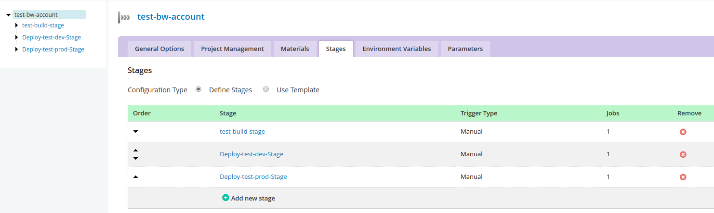
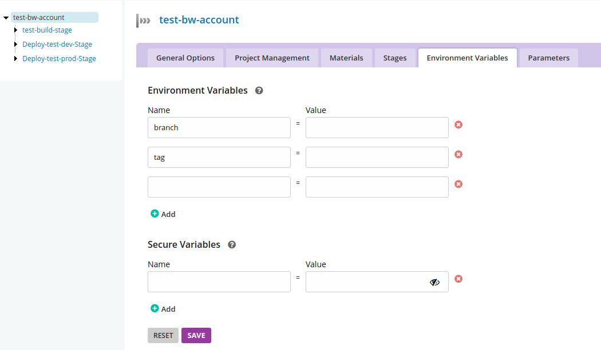
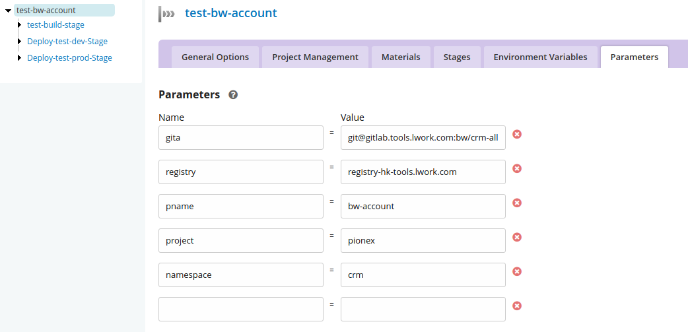
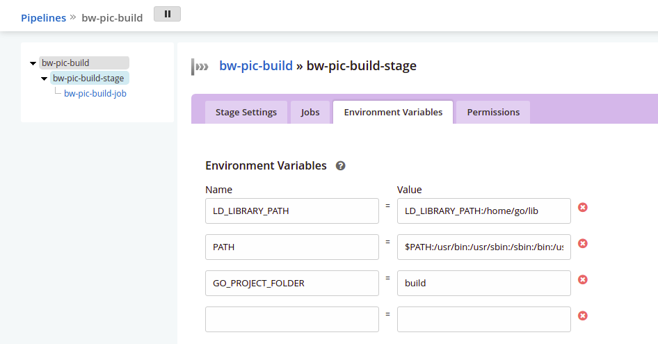
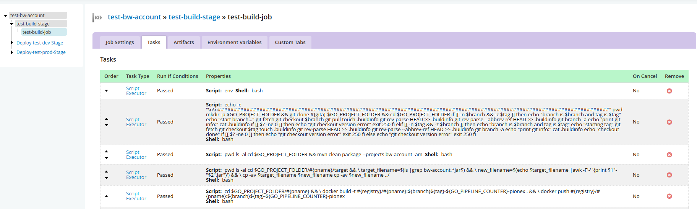

# GoCD Version: 19.8.0，本项目pipelines分三步，

第一、编译及推送镜像到仓库
第二、发布到pionex-dev
第三、如果pionex-dev没有问题，再推送到pionex-prod
1. 首先创建pipline group---pionex
admin->pipelines->ADD NEW PIPELINE GROUP->pionex
2. 创建pipeline
在对应 pipline group->Create a new pipeline within this group,先简单建立一个，然后点击修改。

# **添加了计划的三个步骤**
原图片
General-->Automatic pipeline scheduling,不勾选。如果未选中，此管道将仅安排响应手动/API/计时器触发器。 取消选中此框与制作第一阶段手动相同。

# **添加环境变量**
原图片

# **添加参数**
原图片

# **每个Stage修改**
修改名字，
选择Manual（上一阶段成功后，下阶段手动点击），
取消Fetch Materials，
选择Clean Working Directory，然后保存。

# **每个Job**
原图片

多个piplines之间如果用到依赖的话，**Managing dependencies**
引用https://docs.gocd.org/current/configuration/managing_dependencies.html
# Creating a dependency
Say we have two pipelines - upstream_pipeline and downstream_pipeline . We want downstream_pipeline to automatically trigger following the successful completion of the stage AutoStage1 in pipeline upstream_pipeline. Here’s how we’d achieve this:

Navigate to the Admin section.
On the Pipelines screen, locate the downstream_pipeline pipeline and Edit it.
Click on the Materials tab.
Add a new pipeline dependency material by clicking Add Material and then selecting Pipeline .
You’ll be presented with an Add Material popup (see screenshot)
Enter upstream_pipeline [AutoStage1] in the Pipeline [stage] field (it can also auto-complete)

Now, when the stage “AutoStage1” of “upstream_pipeline” completes, the pipeline “downstream_pipeline” will start building.

**Fetching artifacts from an upstream pipeline**
引用https://docs.gocd.org/current/configuration/managing_dependencies.html
