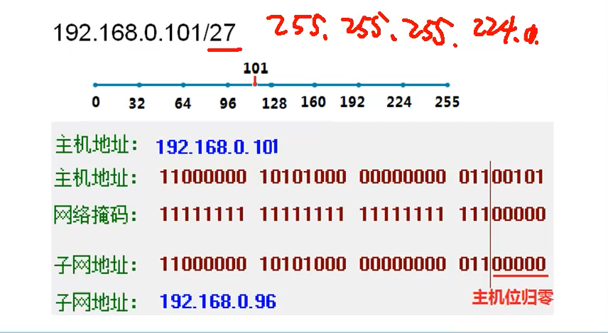

# 1. 二进制，十进制，十六进制
|    二进制 |   十进制  |
| --- | --- |
| 1    |1     |
| 10 | 2 |
|     100|     4|
| 1000 | 8 |
|     10000|     16|
|     100000|     32|
|     1000000|     64|
|     10000000|     128|
|     11000000|     192|
|     11100000|     224|
|     11110000|     240|
|     11111000|     248|
|     11111100|     252|
|     11111110|     254|
|     11111111|     255|
*****
|    二进制 |   十六进制  |
| --- | --- |
| 0001    |1     |
| 0010    |2     |
| 1010    |A     |
|1011     |B    |
|1100     |C     |
| 1101    |D     |
| 1110    |E     |
| 1111    |F     |
**每4位可以代表一位十六进制，不足四位用灵代替**
010 1010 0111 1011 1101
# 2. 理解IP地址
* ip地址由32位二进制组成
* 点分十进制，如172.16.30.56
* 二进制，如
10101100.00010000.00011110.00111000
* 分为两部分，网络ID和主机ID
### 跟打电话一样，如果是本地就不需要加区号，如果是外地就需要加区号
### 判断IP地址是不是一个网段，**用ip地址和子网掩码通过计算来判断**
**172.16**.122.204/255.255.0.0，前2位是网络位 172.16.122.204/16
**172.16**.133.2/255.255.0.0
在一个网段
**172.16.122**.204/255.255.255.0，前3位是网络位 172.16.122.204/24，
**172.16.133**.2/255.255.255.0
不在一个网段
# 3. 网络地址分类
|分类|二进制分类|默认子网掩码|
| --- | --- | ---|
|A类1-127                        |   0000,0001--0111,1111           | 255.0.0.0|
|B类128-191                    | 1000,0000--1011,1111            | 255.255.0.0|
|C类192-223                    |  1100,0000--1101,1111           | 255.255.255.0|
|D类224-239（组播）  |   1110,0000--1110,1111          |
|E类240-255 （研究）|    1111,0000--1111,1111          |
### **0-255一共256个数，256的半数的半数的半数**
**0-128-192-224-240-255，记住这个便于记忆地址分类**

# 4. 保留的私有地址
* 10.0.0.0
* 172.16.0.0--172.31.0.0
* 192.168.0.0--192.168.255.0
* 本网广播255.255.255.255
* 组播，多播224.0.0.0----239.255.255.255
# 5. 等长子网划分
130.2.3.2/255.255.255.0
仍然是B类地址，只不过是划分了0-255个等长网段
### **实例172.16.0.0 255.255.0.0分成四个子网：**
```
172.16.0000 0000.0000 0000
#子网掩码需要向后移动两位
172.16.0100 0000.0000 0000
172.16.1000 0000.0000 0000
172.16.1100 0000.0000 0000
```
一、172.16.0000 0000.0000 0000 #可用地址
* [ ] 172.16.0000 0000.0000 0001 172.16.0.1
* [ ] 172.16.0011 1111.1111 1110 172.16.63.254

二、172.16.0100 0000.0000 0000 #可用地址
* [ ] 172.16.0100 0000.0000 0001 172.16.63.1
* [ ] 172.16.0111 1111.1111 1110 172.16.127.254

三、172.16.1000 0000.0000 0000
* [ ] 172.16.1000 0000.0000 0000
* [ ] 172.16.1000 0000.0000 0000

四、172.16.1100 0000.0000 0000
* [ ] 172.16.1100 0000.0000 0000
* [ ] 172.16.1100 0000.0000 0000

# 6.判断IP地址所属的网段，子网划分只能除2除2
示例：判断192.168.0.101/27所属的子网
0-32-64-96-128-160-192-224-255
192.168.0.101/27  27就是子网掩码向后移动了3位，一位的时候2个网段，二位的时候4个网段，三位的时候8个网段...，根据这个规则画直线，直接就能找出ip属于哪个网段

# 7. 变长子网划分
# 8. 超网合并网段
# 9.网络互连的设备
* 物理层中继系统:
* 数据链路层中继系统：网桥或桥接器（bridge），交换机。基于mac地址转发的，能看懂一二层，一二层设备
* 网络层中继系统：路由器（router）基于IP地址转发的，能看懂一二三层数据，（一二三层设备）
* 网络层以上的中继系统：网关（gateway）
# 10.网络层协议
ARP IP ICMP IGMP
计算机通信第一步是用arp协议，通过广播解析本网段计算机的mac地址
IP协议（RIP OSPF BGP都是动态路由协议 ）
# 11.静态路由
网络畅通的条件，数据包有去有回 
# 12.动态路由

RIP协议，路由器每隔30秒广播自己的路由表，同样配置有RIP协议会且收到广播的路由器，会自动学习这条路由表。
路由器超过一段时间没有收到相邻路由器的广播，会把这条路由表删除
RIP最大不能超过16跳
缺点：容易形成环

**OSPF协议，开放式最短路径优先协议** ，选择路径使用带宽，触发式更新，支持多区域，
邻居表，用hello包来发现邻居
链路状态表
OSPF计算路由表

# 13.NAT，网络地址转换
 内网通过路由NAT修改内网地址为公网地址
# 14.VPN
内网数据包再加一层vpn所在的ip地址-->vpn收到数据后，去掉vpn的ip地址，再转到内网地址
帐号密码+加密，相当于专线一样，虚拟的专有网络

