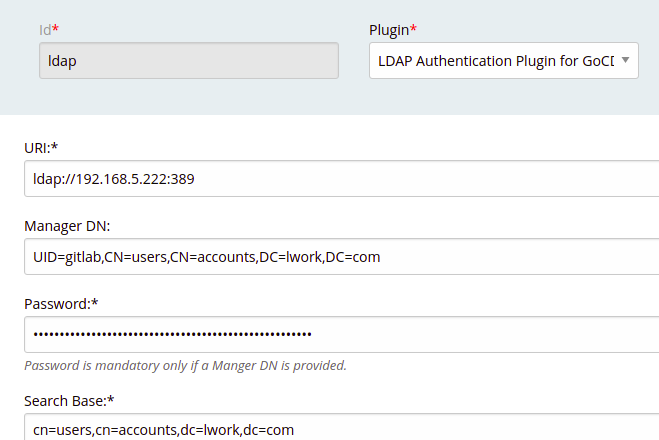
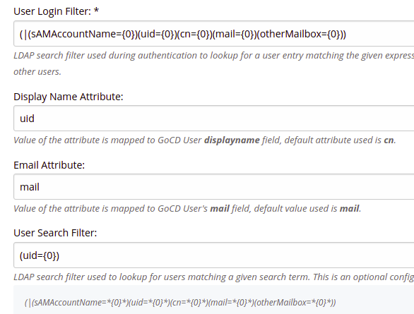

# Authorization Configurations


# core服务器
```
root@ali-hk-public-ops-k8s-master03:/etc/tinc/lwork# cat tinc-up
#!/bin/sh
ifconfig $INTERFACE 172.16.100.1 netmask 255.255.255.0
# route add -net 172.31.0.0/16 gw 172.16.100.8 是本tinc集群其中一台服务器的ip，作用是???
root@ali-hk-public-ops-k8s-master03:/etc/tinc/lwork# cat tinc.conf
Name=core
Interface=lwork
Mode=switch
Port=1190
PrivateKeyFile=/etc/tinc/lwork/rsa_key.priv
root@ali-hk-public-ops-k8s-master03:/etc/tinc/lwork# cat hosts/core
Compression=9
Subnet=172.16.100.1/32
Address=<core服务器外网地址>
Port=1190

-----BEGIN RSA PUBLIC KEY-----
......
-----END RSA PUBLIC KEY-----
root@ali-hk-public-ops-k8s-master03:/etc/tinc/lwork# cat hosts/freeipa01
Compression=9
Subnet=172.16.100.5/32
Address=120.78.72.196 并不是这台机器的外网IP ???
Port=1190

-----BEGIN RSA PUBLIC KEY-----
...
-----END RSA PUBLIC KEY-----
root@ali-hk-public-ops-k8s-master03:/etc/tinc/lwork/hosts# cat hkmaster01
Compression=9
Subnet=172.16.100.6/32
Address=120.78.72.196 并不是这台机器的外网ip???
Port=1190

-----BEGIN RSA PUBLIC KEY-----
......
-----END RSA PUBLIC KEY-----
```
# hkmaster01
```
root@ali-hk-public-ops-k8s-master01:/etc/tinc/lwork# cat tinc-up
#!/bin/sh
ifconfig $INTERFACE 172.16.100.6 netmask 255.255.255.0
route add -net 192.168.5.0 netmask 255.255.255.0 gw 172.16.100.5
#route add -net 172.31.0.0/16 gw 172.16.100.8
root@ali-hk-public-ops-k8s-master01:/etc/tinc/lwork# cat tinc.conf
Name=hkmaster01
ConnectTo=core
Interfce=lwork
Mode=switch
Port=1190
PrivateKeyFile=/etc/tinc/lwork/rsa_key.priv
root@ali-hk-public-ops-k8s-master01:/etc/tinc/lwork# cat hosts/hkmaster01
Compression=9
Subnet=172.16.100.6/32
Address=120.78.72.196 ???
Port=1190

-----BEGIN RSA PUBLIC KEY-----
...
-----END RSA PUBLIC KEY-----
root@ali-hk-public-ops-k8s-master01:/etc/tinc/lwork# cat hosts/core
Compression=9
Subnet=172.16.100.1/32
Address=172.18.164.138 core服务器内网ip
Port=1190

-----BEGIN RSA PUBLIC KEY-----
...
-----END RSA PUBLIC KEY-----
root@ali-hk-public-ops-k8s-master01:/etc/tinc/lwork# cat hosts/
core        hkmaster01
```
# freeipa01
```
[root@ali-hn-public-ops-freeipa01 lwork]# cat tinc-up
#!/bin/sh
ifconfig $INTERFACE 172.16.100.5 netmask 255.255.255.0

route add -host 8.8.8.8  gw 172.16.100.1
route add -host 8.8.4.4  gw 172.16.100.1
route add -net 172.17.0.0 netmask 255.255.0.0 gw 172.16.100.1
route add -net 172.18.0.0 netmask 255.255.0.0 gw 172.16.100.1
[root@ali-hn-public-ops-freeipa01 lwork]# cat tinc.conf
Name=freeipa01
ConnectTo=core
Interfce=lwork
Mode=switch
Port=1190
PrivateKeyFile=/etc/tinc/lwork/rsa_key.priv
[root@ali-hn-public-ops-freeipa01 lwork]# cat hosts/core
Compression=9
Subnet=172.16.100.1/32
Address=<core服务器外网ip>
Port=1190

-----BEGIN RSA PUBLIC KEY-----
...
-----END RSA PUBLIC KEY-----
[root@ali-hn-public-ops-freeipa01 lwork]# cat hosts/freeipa01
Compression=9
Subnet=172.16.100.5/32
Address=120.78.72.196???
Port=1190

-----BEGIN RSA PUBLIC KEY-----
...
-----END RSA PUBLIC KEY-----
[root@ali-hn-public-ops-freeipa01 lwork]# cat hosts/
core       freeipa01
```