# 一、新建pipeline组，名字inner-crm
admin-->pipelines-->create new pipeline group-->inner-crm
# 二、新建pipeline名字inner-bw-pic
add new pipeline-->Part 1: Material-->Material Type-->Git-->Repository URL-->git@gitlab.51sw.cc:inner/inner-bw-pic.git-->Part 2,3,4名字随便取，到时候修改
### 第一次连接gitlab
```
kubectl exec -it -n gocd gocd-server-78979ff8c8-6fqqm -- /bin/bash
   83  ssh-keygen 
   85  cd .ssh/
   87  cat id_rsa.pub 
登录gitlab-->点击profile settings-->SSH Keys-->打开id_rsa.pub（公钥） 复制全部内容到Key这个选项
   89  git clone git@gitlab.51sw.cc:inner/inner-bw-pic.git
```
# 三、配置新inner-bw-pic
inner-bw-pic-->GENERAL选项-->取消Automatic pipeline scheduling，这是第一pipeline，需要手动处理，其他默认
inner-bw-pic-->STAGES选项-->修改stages名字为inner-bw-pic-build-stage
inner-bw-pic-->ENVIRONMENT VARIABLES
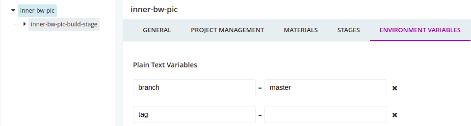
**branch默认是master
如果选择tag，需要手动填写**
inner-bw-pic-->PARAMETERS
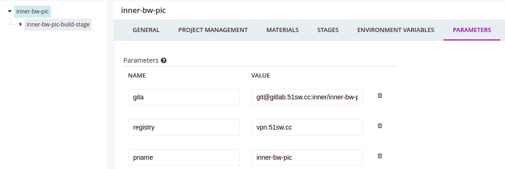
**新建参数，便于在脚本中引用。**
# 四、配置inner-bw-pic-build-stage
inner-bw-pic-build-stage-->STAGE SETTINGS-->开启clean working directory
inner-bw-pic-build-stage-->JOBS-->修改名字为inner-bw-pic-build-job
inner-bw-pic-build-stage-->ENVIRONMENT VARIABLES
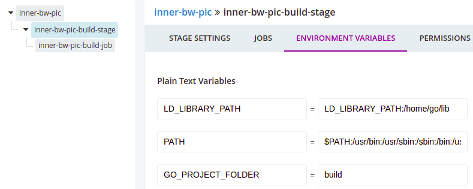
申明gocd-server和gocd-agent的k8spod使用的环境变量
构建的时候需要用到maven，jdk，nodejs等，需要手动安装到/data/ops/homego下面，这个目录是挂载到了gocd容器中。bin下面是docker和kubectl这两个命令。
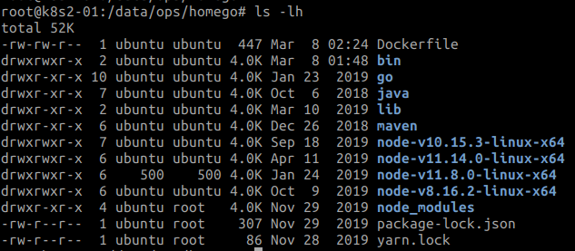
# 五、配置inner-bw-pic-build-job
inner-bw-pic-build-job-->TASKS,这里写的脚本放在最下面
gocd 插件[https://github.com/gocd-contrib](https://github.com/gocd-contrib)
```
*Usage:*

Download jar from releases & place it in`<go-server-location>/plugins/external`& restart GoCD Server.

root@ali-hk-public-ops-k8s-master01:/data/ops/godata/plugins/external# ls
script-executor-0.3.0.jar
```

这里需要一款叫做“script-executor-task”的GoCD插件。有了这款插件后，你就可以像shell脚本一样编排指令，从而愉快地合并臃肿的task了。  
值得一提的是，这个插件的初衷是简化task中命令的书写和排序，而不提倡滥用它编排大量琐碎的指令。不管是用jenkins还是GoCD，最佳实践是将指令放到脚本文件中，并纳入代码版本仓库（SCM）
inner-bw-pic-build-job-->ARTIFACTS
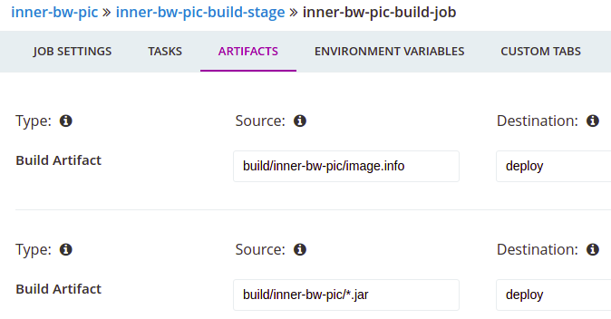
**这是本管道要传给下一管道的文件，为了保证一致性**
如果是用的镜像部署，就用到image.info
如果是jar包部署，就直接用传下来的jar包
# 整体效果图
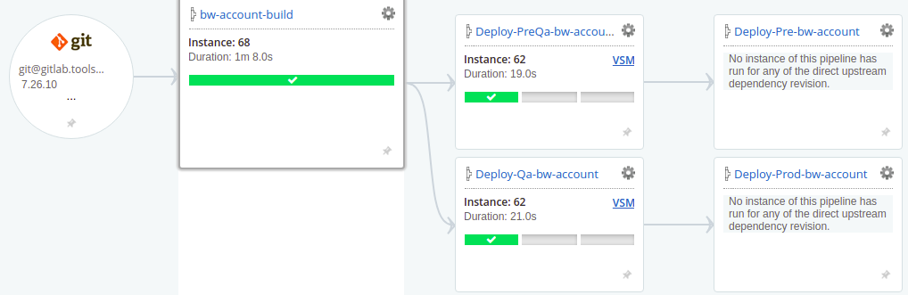
# inner-bw-pic-build-job-->TASKS-->脚本
第二步
```
echo -e "\n\n##########################################################################################################################"
pwd
mkdir -p $GO_PROJECT_FOLDER && git clone #{gita} $GO_PROJECT_FOLDER && cd $GO_PROJECT_FOLDER
if [[ -n $branch && -z $tag ]]
then       
        echo "branch is $branch and tag is $tag"
        echo "start branch..."
        git fetch
        git checkout $branch
        git pull
        touch  .buildinfo
        git rev-parse HEAD >> .buildinfo
        git rev-parse --abbrev-ref HEAD >> .buildinfo
        git branch -a
        echo "print git info:"
        cat .buildinfo
       if [[ $? -ne 0 ]]
       then
                echo "git checkout version error"
                exit 250
       fi
elif [[ -n $tag && -z $branch ]]
then
        echo "branch is $branch and tag is $tag"
        echo "starting tag"
        git fetch
        git checkout $tag
        touch  .buildinfo
        git rev-parse HEAD >> .buildinfo
        git rev-parse --abbrev-ref HEAD >> .buildinfo
        git branch -a
        echo "print git info:"
        cat .buildinfo
        echo "checkout done"
       if [[ $? -ne 0 ]]
       then
                echo "git checkout version error"
                exit 250
       fi
else
                echo "git checkout version error"
                exit 250
fi
```
第三步
```
pwd
ls -al
cd $GO_PROJECT_FOLDER &&  mvn clean install -Dmaven.test.skip=true
```
第四步
Dockerfile应该放在代码里面，这样就不用每次替换了。
```
pwd
ls -al
cd $GO_PROJECT_FOLDER/ && \
sed "s/dog/#{pname}/g" /home/go/Dockerfile >Dockerfile
```
第五步
```
cd $GO_PROJECT_FOLDER/ && \
docker build -t  #{registry}/#{pname}:${branch}${tag}-${GO_PIPELINE_COUNTER} . && \
docker push #{registry}/#{pname}:${branch}${tag}-${GO_PIPELINE_COUNTER} && \
echo "dimages=#{registry}/#{pname}:${branch}${tag}-${GO_PIPELINE_COUNTER}" >./image.info && echo "deploy=#{pname}" >>./image.info && cat image.info && \
docker images |grep #{pname}  |head -n 20
```
# 六、接第一条pipline，Deploy-QA-bw-pic
新建管道选择第一条pipline为上游管道
配置上游管道
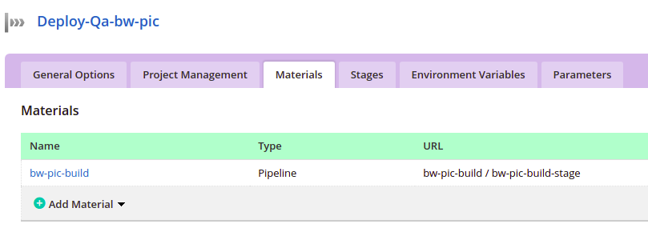
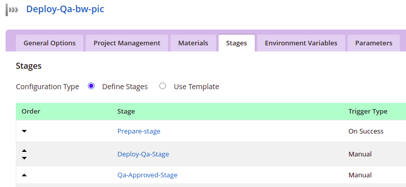
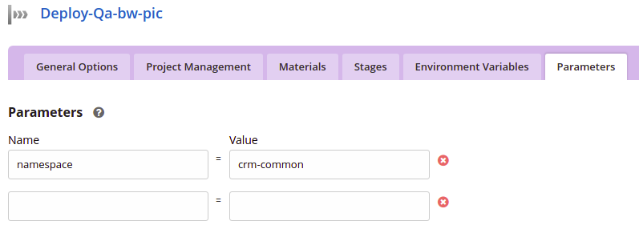
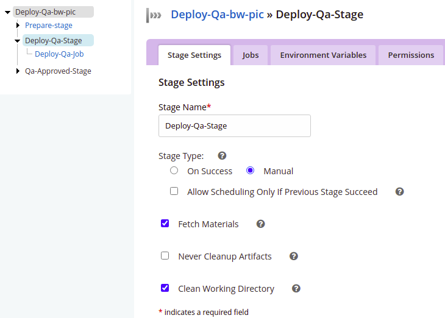
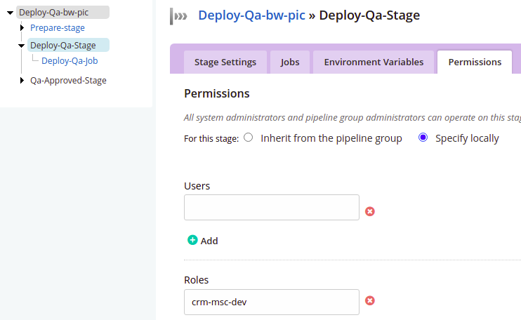

需要配置接受上游传下来的文件
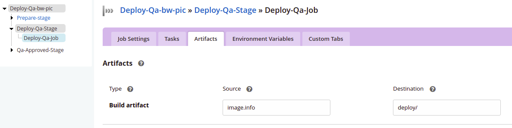
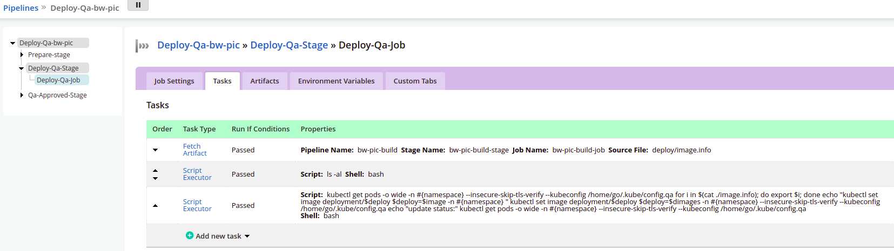
```
kubectl get pods -o wide  -n #{namespace} --insecure-skip-tls-verify  --kubeconfig /home/go/.kube/config.qa

for i in $(cat ./image.info); do export $i; done

echo "kubectl  set image  deployment/$deploy  $deploy=$image -n  #{namespace} "
kubectl  set image  deployment/$deploy  $deploy=$dimages -n  #{namespace}  --insecure-skip-tls-verify  --kubeconfig /home/go/.kube/config.qa

echo "update status:"
kubectl get pods -o wide -n  #{namespace}  --insecure-skip-tls-verify  --kubeconfig /home/go/.kube/config.qa
```
# 七、前端pipline
## 1、前端的第一条管道
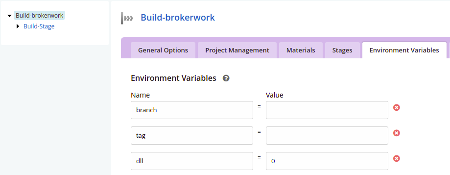
## Build-brokerwork » Build-Stage » Build-Job » Tasks
第一步Command:env
第二步
```
echo -e "\n\n##########################################################################################################################"
pwd
mkdir -p $GO_PROJECT_FOLDER && git clone #{gita} $GO_PROJECT_FOLDER && cd $GO_PROJECT_FOLDER
if [[ -n $branch && -z $tag ]]
then       
        echo "branch is $branch and tag is $tag"
        echo "start branch..."
        git fetch
        git checkout $branch
        git pull
        touch  .buildinfo
        git rev-parse HEAD >> ./buildinfo
        git rev-parse --abbrev-ref HEAD >> ./buildinfo
       echo -e ${branch}${tag} > ./mversion
       echo -e $dll >> ./mversion
        git branch -a
        echo "print git info:"
        cat .buildinfo
       if [[ $? -ne 0 ]]
       then
                echo "git checkout version error"
                exit 250
       fi
elif [[ -n $tag && -z $branch ]]
then
        echo "branch is $branch and tag is $tag"
        echo "starting tag"
        git fetch
        git checkout $tag
        touch  .buildinfo
        git rev-parse HEAD >> ./buildinfo
        git rev-parse --abbrev-ref HEAD >> ./buildinfo
       echo -e ${branch}${tag} > ./mversion
       echo -e $dll >> ./mversion
        git branch -a
        echo "print git info:"
        cat .buildinfo
        echo "checkout done"
       if [[ $? -ne 0 ]]
       then
                echo "git checkout version error"
                exit 250
       fi
else
                echo "git checkout version error"
                exit 250
fi
```
第三步
```
cd $GO_PROJECT_FOLDER  && yarn &&  yarn prod:qa --env.version=${branch}${tag}  &&  if [[ $dll  -ne 1 ]]; then  rm -rf dist/dll; fi
```
## 2、新建管道选择第一条pipline为上游管道，根据需求设计需要几步stage
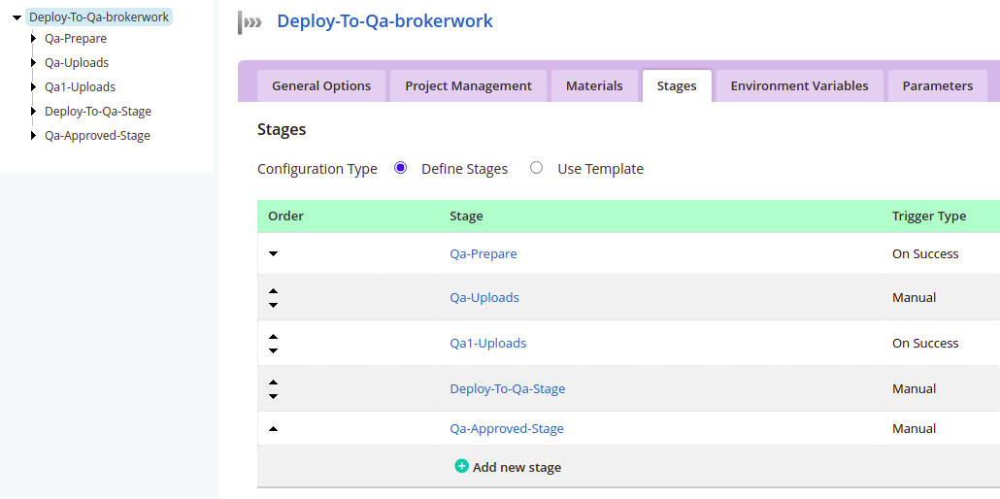
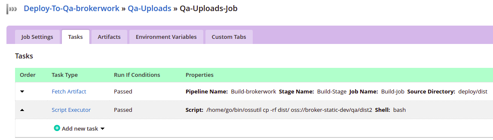
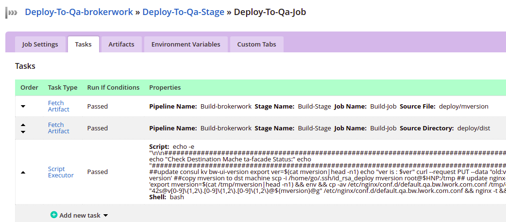
```
echo -e "\n\n##########################################################################################################################"
echo "Check  Destination Mache  ta-facade Status:"
echo "##########################################################################################################################"
##update consul kv bw-ui-version
export ver=$(cat mversion|head -n1)
echo "ver is : $ver"
curl --request PUT --data "old:v6.12.37,new:$ver" 'http://192.168.60.85:8500/v1/kv/bw-ui-version'

##copy mversion to dst machine
scp -i  /home/go/.ssh/id_rsa_deploy  mversion  root@$HNP:/tmp

## update nginx-config
ssh -i /home/go/.ssh/id_rsa_deploy  root@$HNP 'export mversion=$(cat /tmp/mversion|head -n1) && env && cp -av /etc/nginx/conf.d/default.qa.bw.lwork.com.conf /tmp/default.qa.bw.lwork.com.conf_$mversion  && sed  -i "42s@v[0-9]\{1,2\}.[0-9]\{1,2\}.[0-9]\{1,2\}@${mversion}@g" /etc/nginx/conf.d/default.qa.bw.lwork.com.conf && nginx -t && nginx -s reload'
```
